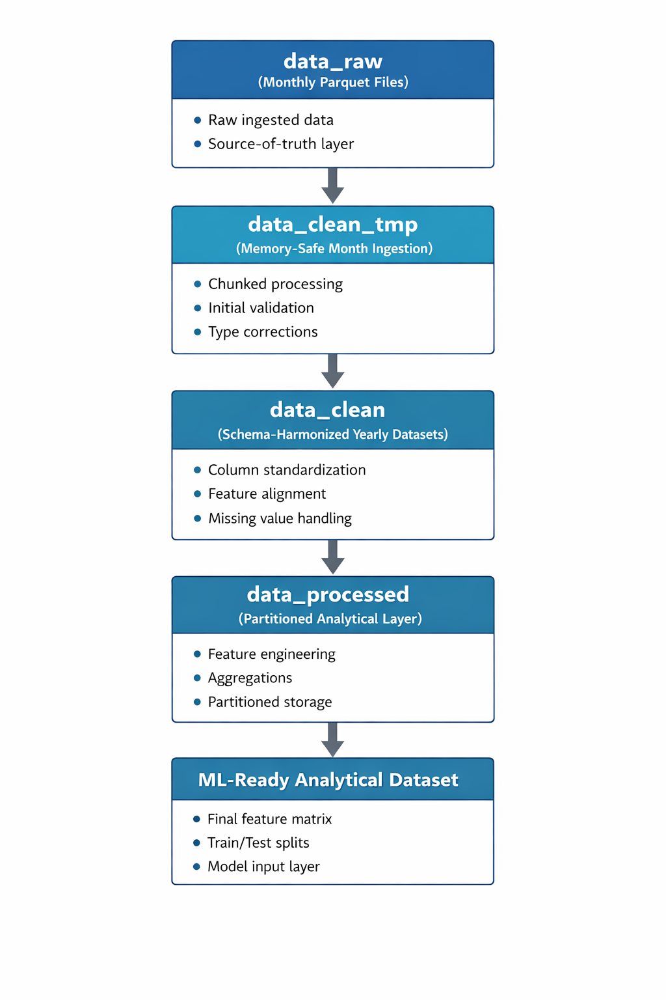
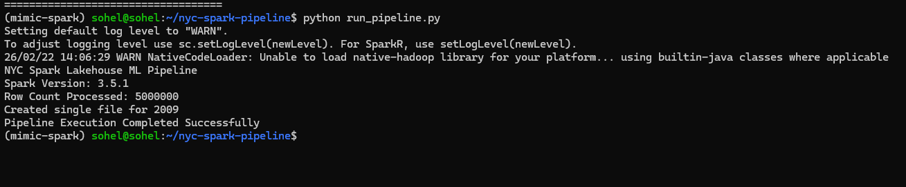

# 🚕 NYC Spark Lakehouse & ML Pipeline

Production-style distributed data engineering and ML-ready lakehouse pipeline built with PySpark, Docker, and CI/CD automation using NYC Yellow Taxi data.

This project demonstrates scalable Spark processing, schema evolution handling, automated testing, containerized deployment, and production-style pipeline architecture.

---

## 🧰 Tech Stack

[](https://www.python.org/)
[](https://spark.apache.org/)
[](https://spark.apache.org/)
[](https://www.docker.com/)
[](https://github.com/features/actions)
[](https://parquet.apache.org/)
[]()
[]()
[](https://ubuntu.com/)
[](https://git-scm.com/)

---

## 📌 Project Overview

NYC Yellow Taxi data is published as monthly parquet files across multiple years. Although already in parquet format, schemas evolve over time and require harmonization for scalable analytics and ML.

This project implements a **production-style lakehouse architecture** with automated deployment capabilities.

Key capabilities:

- Handles schema drift across years
- Prevents Spark memory crashes during ingestion
- Optimizes partitioning for distributed execution
- Builds ML-ready analytical datasets
- Containerized deployment using Docker
- Automated testing and CI/CD pipeline execution
- Production-style logging and monitoring

---

## 🏗 Architecture Overview

This pipeline follows a layered lakehouse architecture:
Raw Data → Ingestion Layer → Harmonization Layer → Analytical Layer → ML-Ready Dataset

<p align="center">

</p>

Layer responsibilities:

- Raw ingestion
- Schema harmonization
- Partition optimization
- Analytical dataset construction
- ML-ready output generation

---

## 📊 Dataset Scale

The pipeline processes large-scale NYC Yellow Taxi trip data:

- **17,089,605 records** ingested and harmonized
- Year-level standardized parquet dataset
- Optimized across **72 Spark partitions**
- Partition-aware dataset design for distributed execution
- Structured for scalable analytical and ML-ready workflows

## ⚙ Example Execution

Below shows a successful yearly ingestion and merge process executed with PySpark:




## ⚡ Performance Engineering

Production-style performance optimizations implemented:

- Avoided full dataset in-memory unions
- Streamed month-level ingestion
- Controlled Spark repartitioning strategy
- Prevented small-file explosion problem
- Minimized shuffle operations
- Partition pruning optimization

---

## 🔄 Schema Evolution Handling

NYC Taxi schemas evolve across years. This pipeline handles schema evolution using:

- `unionByName(allowMissingColumns=True)`
- Explicit datatype standardization
- Column alignment validation
- Physical/logical parquet schema resolution

---

## 🐳 Docker Containerized Deployment

This pipeline is fully containerized for reproducible deployment.

Build Docker image:


docker build -t nyc-spark-pipeline .
Run pipeline inside container:
docker run nyc-spark-pipeline
## CI/CD Automation

CI/CD implemented using GitHub Actions.

Automatically runs on every push:

Executes Spark pipeline

Runs automated tests

Builds Docker container

Validates deployment readiness

Workflow file:
.github/workflows/cicd.yml
## Logging and Monitoring

Pipeline includes automated logging:
Logs include:

Execution status

Spark version

Row count processed

Execution time

Error handling

Example log output:

INFO Pipeline started
INFO Spark version: 3.5.1
INFO Row count processed: 5000000
INFO Pipeline execution completed successfully
INFO Pipeline execution time: 4.81 seconds

```` text
nyc-spark-lakehouse-ml-pipeline/
│
├── jobs/              # Spark job orchestration
├── src/               # Core transformations & logging
├── tests/             # Automated tests
├── logs/              # Execution logs
├── outputs/           # Pipeline outputs
├── docs/              # Architecture images
├── Dockerfile         # Container configuration
├── requirements.txt
├── .github/workflows/ # CI/CD pipeline
└── README.md

````

## 🎯 What This Project Demonstrates

- Distributed data engineering workflows
- Handling large-scale multi-year datasets
- Schema drift resolution
- Spark memory management strategies
- Partition-aware dataset design
- Lakehouse architectural layering
- Production-style pipeline structuring


## 📊 ML-Ready Dataset

The final `data_processed/` layer is partitioned by:

year=YYYY/
month=MM/


This enables:

- Efficient distributed training
- Partition pruning
- Faster analytical queries
- Scalable model experimentation


## 🚀 How to Run


python -m jobs.clean_year_tmp

📜 License

MIT License


