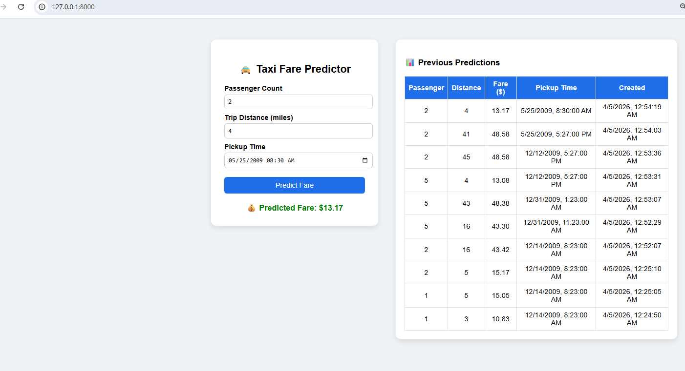
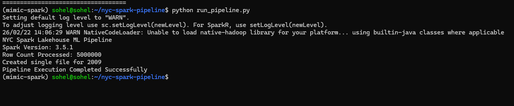

# 🚕 NYC Spark Lakehouse & ML Pipeline

Production-style distributed data engineering and ML-ready lakehouse pipeline built with PySpark, Docker, and CI/CD automation using NYC Yellow Taxi data.

This project demonstrates scalable Spark processing, schema evolution handling, automated testing, containerized deployment, and production-style pipeline architecture.

---

## 🧰 Tech Stack

[](https://www.python.org/)
[](https://spark.apache.org/)
[](https://spark.apache.org/)
[](https://www.docker.com/)
[](https://github.com/features/actions)
[](https://parquet.apache.org/)
[]()
[]()
[](https://ubuntu.com/)
[](https://git-scm.com/)

---

## 📌 Project Overview

NYC Yellow Taxi data is distributed as monthly parquet files across multiple years. 
Although stored in parquet format, schemas evolve over time, requiring harmonization 
for scalable analytics and machine learning.

This project implements a **production-grade lakehouse architecture** that supports 
large-scale data processing, feature engineering, and real-time ML inference.

### 🚀 Key Capabilities

- Handles schema drift across multiple years of taxi data
- Prevents Spark memory failures during large-scale ingestion
- Optimizes partitioning for distributed processing (PySpark)
- Builds ML-ready datasets for modeling
- Deploys real-time prediction API using FastAPI
- Stores predictions in PostgreSQL for monitoring and analysis
- Supports containerized deployment with Docker (optional)
- Implements production-style logging and modular pipeline design

---

## 💻 Real-Time Prediction API (Taxi Fare Estimation)

The system includes a **real-time prediction service** that estimates taxi fares 
based on user inputs.

### 🔮 Features

- Accepts user inputs:
  - Passenger count
  - Trip distance
  - Pickup timestamp
- Performs feature engineering (hour, weekday, month)
- Generates predictions using a trained XGBoost model
- Logs predictions into PostgreSQL for tracking and analysis
- Provides a simple web UI for interaction

### 📊 Application Interface

<p align="center">

</p>

---

## 🏗 System Architecture (End-to-End)

This project follows a **modern ML system architecture**:

```text
Raw Data (NYC Taxi Parquet)
        ↓
PySpark Data Pipeline
        ↓
PostgreSQL (Analytical Storage)
        ↓
Feature Engineering (Time-based Features)
        ↓
XGBoost Model Training
        ↓
FastAPI (Real-Time Inference API)
        ↓
Web UI (User Interaction)
        ↓
Prediction Logging (PostgreSQL)
````

## 📊 Dataset Scale

The pipeline processes large-scale NYC Yellow Taxi trip data:

- **17,089,605 records** ingested and harmonized
- Year-level standardized parquet dataset
- Optimized across **72 Spark partitions**
- Partition-aware dataset design for distributed execution
- Structured for scalable analytical and ML-ready workflows

## ⚙ Example Execution

Below shows a successful yearly ingestion and merge process executed with PySpark:




## ⚡ Performance Engineering

Production-style performance optimizations implemented:

- Avoided full dataset in-memory unions
- Streamed month-level ingestion
- Controlled Spark repartitioning strategy
- Prevented small-file explosion problem
- Minimized shuffle operations
- Partition pruning optimization

---

## 🔄 Schema Evolution Handling

NYC Taxi schemas evolve across years. This pipeline handles schema evolution using:

- `unionByName(allowMissingColumns=True)`
- Explicit datatype standardization
- Column alignment validation
- Physical/logical parquet schema resolution

---

## 📊 Monitoring Dashboard
Real-time monitoring of API requests and system performance using Prometheus and Grafana:

### 📈 Monitoring & System Metrics (Grafana)


<p align="center">

</p>


## 🐳 Docker Containerized Deployment

This pipeline is fully containerized for reproducible deployment.

Build Docker image:

## 🔁 CI/CD Pipeline

This project uses **GitHub Actions for continuous integration and deployment (CI/CD)** to automate the build and deployment process.

---

### ⚙️ Pipeline Overview

````text
Local Development
        ↓
    git push
        ↓
GitHub Actions (CI/CD)
        ↓
Build Docker Image
        ↓
Push to AWS ECR
        ↓
Deploy to AWS EC2
        ↓
Run FastAPI + ML Model + Monitoring

## 🚀 How to Run

````

git clone <repo>
cd nyc-spark-pipeline

docker-compose up --build

API → http://localhost:8000/predict
Grafana → http://localhost:3000
Airflow → http://localhost:8080